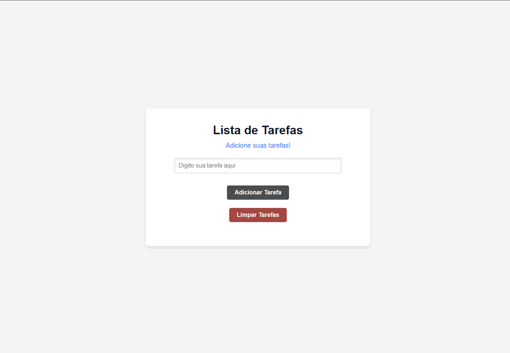

# 📋 Lista de Tarefas (To-Do List)

Aplicação simples de **Lista de Tarefas** desenvolvida com **HTML, CSS e JavaScript puro**.

O objetivo do projeto é permitir que o usuário organize suas tarefas do dia a dia de forma rápida e prática.

A aplicação permite adicionar novas tarefas, marcar tarefas como concluídas e removê-las da lista.

---

## 🚀 Funcionalidades

- ➕ Adicionar novas tarefas  
- ✅ Marcar tarefas como concluídas  
- ❌ Remover tarefas da lista  
- 📱 Interface simples e intuitiva  
- ⚡ Manipulação do DOM com JavaScript puro  

---

## 🛠️ Tecnologias utilizadas

- HTML5  
- CSS3  
- JavaScript (Vanilla JS)  
- Git  
- GitHub  

---

## 📂 Estrutura do Projeto

```
lista-de-tarefas
│
├── assets
├── css
├── img
├── js
├── index.html
└── README.md
```

---

## 💻 Como executar o projeto

1. Clone o repositório

```bash
git clone https://github.com/vinioliveira-developer/lista-de-tarefas.git
```

2. Acesse a pasta do projeto

```bash
cd lista-de-tarefas
```

3. Abra o arquivo `index.html` no navegador.

---

## 🎯 Objetivo do Projeto

Este projeto foi desenvolvido como prática de **JavaScript para manipulação de DOM, eventos e lógica de programação**, simulando uma aplicação simples utilizada no dia a dia.

Também faz parte da construção do meu **portfólio como desenvolvedor Front-End**.

---

## 📸 Preview


```

```

---

## 📌 Melhorias futuras

- Salvar tarefas no **LocalStorage**
- Editar tarefas
- Filtros (todas / concluídas / pendentes)
- Melhorar responsividade

---

## 👨‍💻 Autor

**Marcos Vinicius**

- GitHub:  
https://github.com/vinioliveira-developer

- LinkedIn:  
https://www.linkedin.com/in/mvinicius-developer/

---

## ⭐ Contribuição

Se você gostou do projeto, deixe uma ⭐ no repositório!
